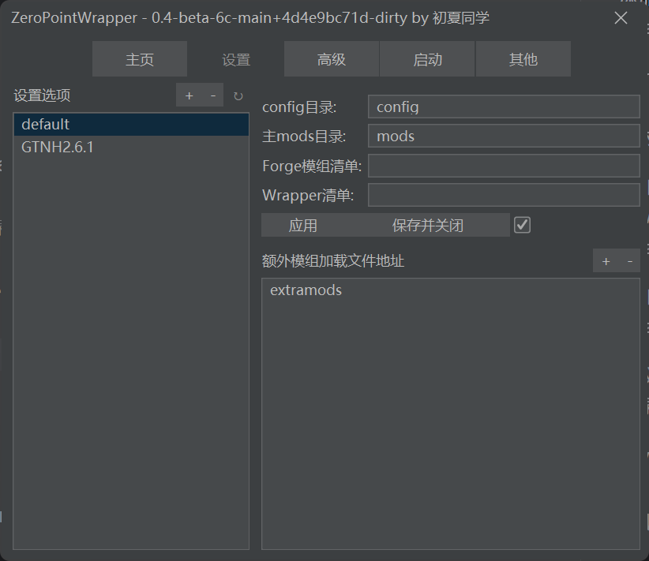
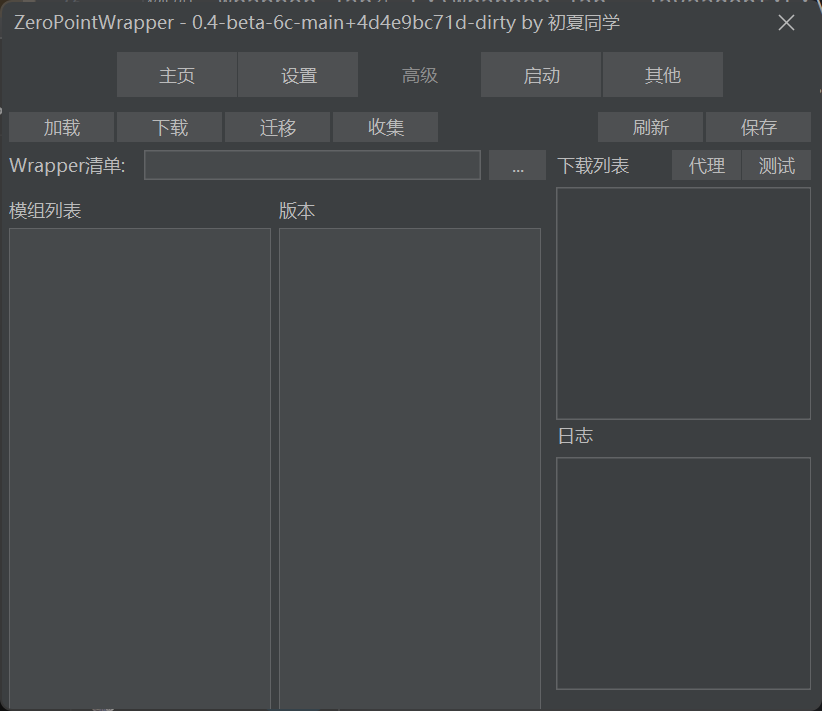
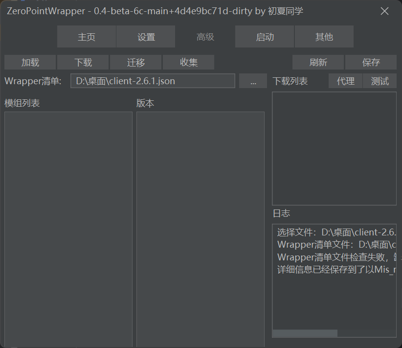
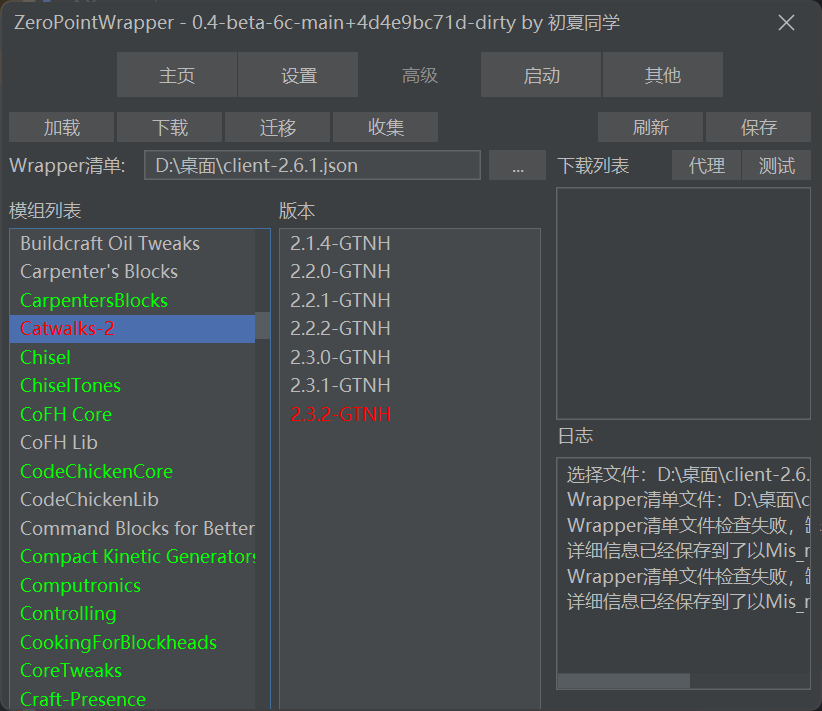
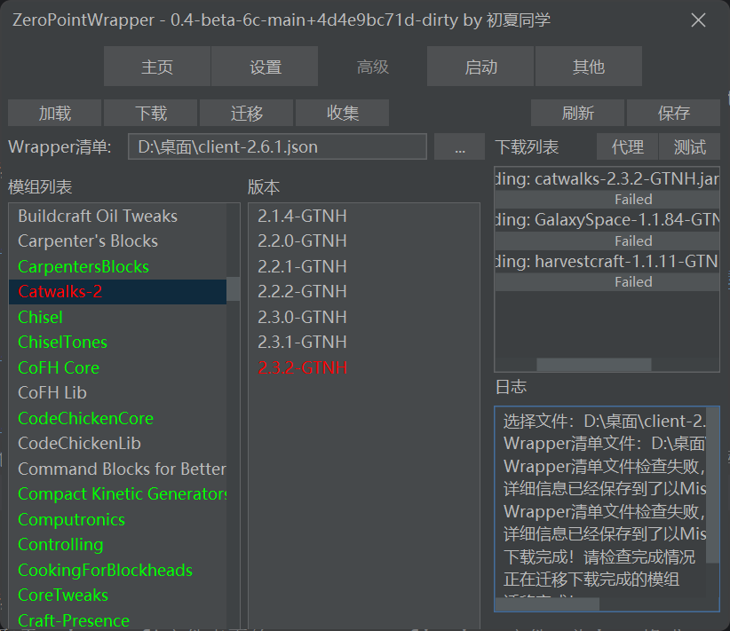
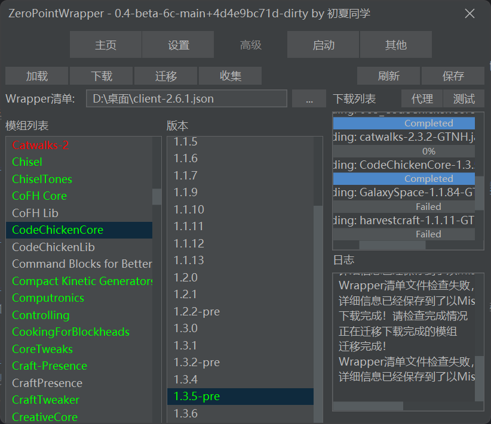
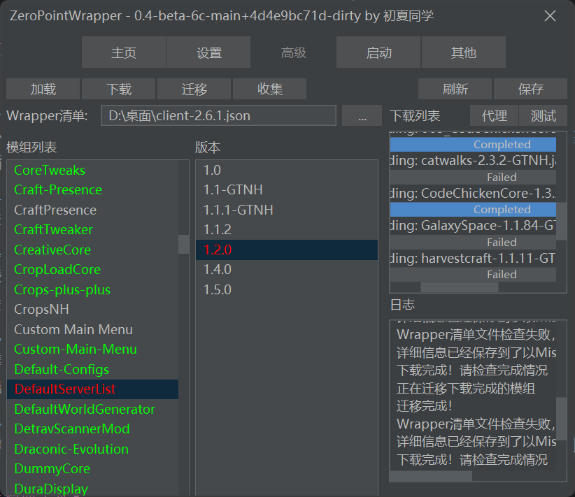
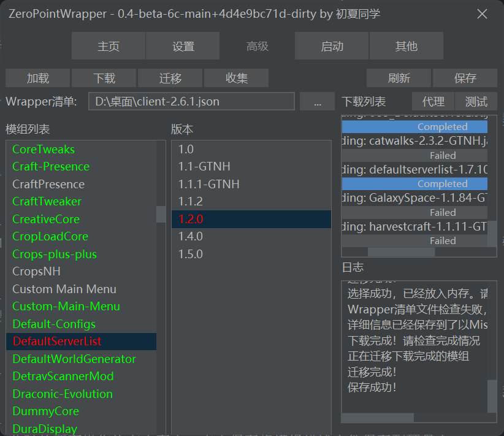

# Wrapper使用教程
-------------------
Zero Point Launcher秽土转生

### 功能
1. 使Forge可以加载更多目录下的模组，可以通过UI配置
2. 根据清单文件检查并下载模组
3. 通过UI更新或回退模组版本
4. 根据清单文件将本地模组仓库中的模组收集到指定目录

GTNH各个版本的清单文件再次仓库[Wrapper](https://github.com/wohaopa/Wrapper/tree/update/release)
通过Issue触发自动整理

通过修改Forge的加载机制来让Forge能识别不同地方的模组并正确加载。
支持的加载方式：1. 主模组文件夹；2. 指定额外模组文件夹；3. Gradle仓库格式模组文件；4. 任意位置模组文件（待更新）。

支持MultiMC系列启动器（Prism Launcher等）、Hello Minecraft Launcher等。暂不支持Plain Craft Launcher II

### 请仔细阅读

### 【使用方法】
添加java虚拟机jvm参数：-javaagent:<wrapper.jar>

<wrapper.jar>表示wrapper.jar的地址，相对（相当于与.minecraft运行时目录）或者绝对路径

例如：wrapper.jar在 C:\wrapper.jar。-javaagent:C:\wrapper.jar

例如：wrapper.jar在.minecraft。-javaagent:wrapper.jar

建议将wrapper.jar存放到.minecraft目录。

-javaagent:wrapper-0.4-beta-6c.jar

### 【UI使用方法】

#### 配置额外加载目录
在配置正确的第一次启动后会出现一个窗口

1. 鼠标点击左侧的设置选项列表进入设置的详细配置
2. 在输入完成设置之后点击应用将设置保存
3. 双击列表选项可以对其进行重命名
4. 点击"+"可以新建一个设置选项
5. 额外模组目录的列表可以拖拽排序
6. 完成之后点击"保存并关闭"即可启动游戏
7. "保存并关闭"按钮普遍的勾选框表示下次不在显示本窗口，删除.minecraft目录内的wrapper.lock即可再次打开此窗口

### 高级配置

1. 输入模组清单文件的地址，也可以点击"..."按钮选择文件，清单文件的[下载地址](https://github.com/wohaopa/Wrapper/tree/update/release)
2. 选择文件后点击加载按钮加载清单文件的内容

3. 点击刷新按钮即可查看清单描述的模组情况

绿色的表示此模组已经在本地模组仓库中存在。红色的表示不存在。本地模组仓库在.minecraft/ModsRepository，使用maven仓库的名规则存放
4. 点击下载按钮即可下载所有缺失的模组

如果下载失败请设置代理，并开启本地代理
5. 下载完成后点击刷新即可

6. 切换模组版本，点击需要切换版本的模组，选择需要切换的版本双击，然后点击刷新即可检查情况。如果确实可以点击下载

7. 此时的所有操作均在内存中，点击保存将模组描述文件保存到硬盘中

8. 点击迁移可以将手动下载的模组迁移到模组窗口中，此时会弹出一个对话框，请选择手动下载的模组所在的文件夹
9. 点击收集可以按照模组描述文件将模组从仓库中复制到一个目录中，点击刷新可以查看失败的模组
10. 点击代理可以设置代理服务器

### 【配置文件】
读取于.minecraft文件夹下的wrapper_config.json文件，为json格式

***active***：当前活跃的配置项，游戏下次启动将以对应的配置策略执行。

***settings***：所有的配置项，用户可以创建多份暂存

配置项详情：以此为例

***GTNH2.6.1***：本配置项的名称，通过修改active的值来使用此配置项目

***config***：不建议修改，只能重定向部分配置文件（计划重定向所有）

***main_mods***：主模组目录，部分模组的资源文件会解压到此（例如：ic2文件夹）

***extra_mods***: 额外模组目录，是个列表，不限制数量

***modsListFile***: gradle仓库显示的模组清单文件。形式特殊，建议使用TidyMods.py脚本.生成。不使用请留空或者删除该条。

### 【问题模组】
目前已知必须放在mods文件夹的模组：

所有模组均不必放置于主模组目录

目前已知必须放在主模组的模组：

（1）Healer: 用于修复log4j2漏洞

### 【建议使用策略】
mods #存放官方包的模组

extramods #存放私货模组

在mods文件夹下存放官方包的模组

在extramods文件夹下存放私货模组

### 【TidyMods使用教程】
1.  安装python3.11及以上版本
2.  将你对应版本的json文件与TidyMods.py放置于mods文件夹。
3.  执行python TidyMods.py等待片刻
4.  脚本将自动生成一个以Forge为前缀的json文件，该文件即为可以被识别的模组清单文件
5.  将该文件移动到.minecraft文件夹内
6.  在wrapper_config.json文件中对应的配置项内填写该文件名（记得带上.json）

对应版本号的json文件在仓库：https://github.com/wohaopa/Wrapper/tree/update/release 内可以找到。本仓库为触发式手动更新，若没有对应版本的json，可以提交一个Issue，Issue带有Release标签，正文内容为GTNH发布的清单文件的下载链接，一般位于 https://github.com/GTNewHorizons/DreamAssemblerXXL/tree/master/releases/manifests 这将会自动产生一个PR与一个新的分支。
